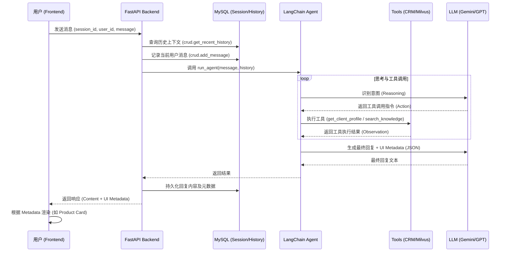

# AI Knowledge Copilot 架构文档

## 1. 请求数据流转 (Request Data Flow)

系统的核心流程是基于 **Agent (代理)** 的意图识别与工具调用。以下是用户发送一条消息后的数据流转路径：



## 2. 功能模块交互 (Functional Module Interaction)

系统分为四个主要层次，各模块之间通过定义良好的接口进行交互：

| 层次 | 模块 | 职责 |
| :--- | :--- | :--- |
| **表示层 (UI)** | React / Tailwind | 提供对话界面，处理不同类型的渲染卡片 (Product Card, Text)。 |
| **接口层 (API)** | FastAPI | 处理 HTTP 请求，集成 CORS，管理会话状态，提取并清理 Agent 返回的 JSON 元数据。 |
| **逻辑层 (Agent)** | LangChain | 编排 Agent 流程。包括 Prompt 模板管理、工具定义 (Tools) 和 LLM 模型适配。 |
| **数据层 (Storage)** | MySQL / Milvus | **MySQL**: 存储结构化数据（会话、聊天历史）。<br>**Milvus**: 存储非结构化知识（保险产品向量）。 |

### 核心交互逻辑
- **Agent Orchestrator**: `agent.py` 是逻辑中心，它根据 `system_prompt` 强制 LLM 在回复末尾输出 JSON 块，用于前端的结构化渲染。
- **RAG 检索**: `rag_utils.py` 封装了与 Milvus 的交互，将用户查询转化为向量并进行相似度搜索。
- **CRM 集成**: `crm_api.py` 提供模拟的客户画像数据，供 Agent 识别客户需求。

## 3. 部署架构 (Deployment Architecture)

系统采用 **Docker 容器化** 部署，通过 `docker-compose.yml` 编排所有基础设施。

### 容器拓扑
- **App Containers**:
  - `frontend`: 运行 Vite/React 应用（通常映射到 5173 端口）。
  - `backend`: 运行 FastAPI 应用（通常映射到 8000 端口）。
- **Infrastructure Containers**:
  - **MySQL (8.0)**: 存储业务关系数据。
  - **Redis (7.0)**: 预留用于缓存或消息队列。
  - **Milvus Stack**:
    - `milvus-standalone`: 向量数据库核心。
    - `etcd`: 元数据存储。
    - `minio`: 向量数据文件存储。

### 网络与端口映射
- **外部访问**: 用户通过浏览器访问前端端口。
- **内部通信**: 后端通过容器名（如 `mysql:3306`, `milvus-standalone:19530`）与数据库通信，确保了环境的隔离性与一致性。

## 4. 核心代码调用流程 (Core Code Calling Flow)

以下是后端处理聊天请求时的核心代码调用链路：

### 4.1 接口层入口 (`backend/main.py`)
1. **`chat_endpoint(request)`**:
   - 调用 `crud.get_recent_history(db, session_id)` 获取历史上下文。
   - 调用 `crud.add_message(db, ..., "user")` 持久化用户提问。
   - 调用 `agent.run_agent(message, history, model)` 进入逻辑层。

### 4.2 逻辑层编排 (`backend/agent.py`)
2. **`run_agent(user_input, chat_history)`**:
   - 调用 `get_agent_executor(model_name)` 获取或初始化 LangChain 执行器。
   - 执行器通过 `executor.invoke()` 启动 ReAct 循环。
   - **工具触发**:
     - 若需查询画像：调用 `get_client_profile_tool(name)`。
     - 若需检索知识：调用 `search_knowledge_tool(query)`。

### 4.3 知识检索实现 (`backend/rag_utils.py`)
3. **`search_knowledge(query, embeddings)`**:
   - 使用 `embeddings.embed_query(query)` 将查询文本向量化。
   - 调用 `milvus_client.search(...)` 在向量数据库中进行近似最近邻搜索 (ANN)。
   - 返回最相关的 Top-K 条知识片段。

### 4.4 结果返回与持久化 (`backend/main.py`)
4. **清理与存储**:
   - 使用正则表达式 `re.search(r'```json...```')` 从 LLM 回复中提取结构化元数据。
   - 调用 `crud.add_message(db, ..., "assistant", metadata)` 存储助手回复。
   - 返回 JSON 给前端。

